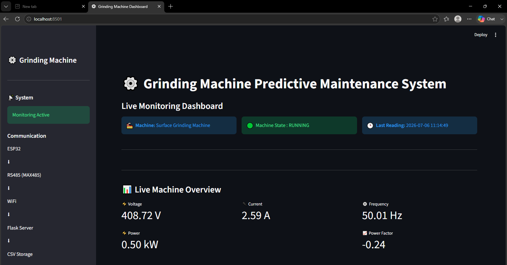
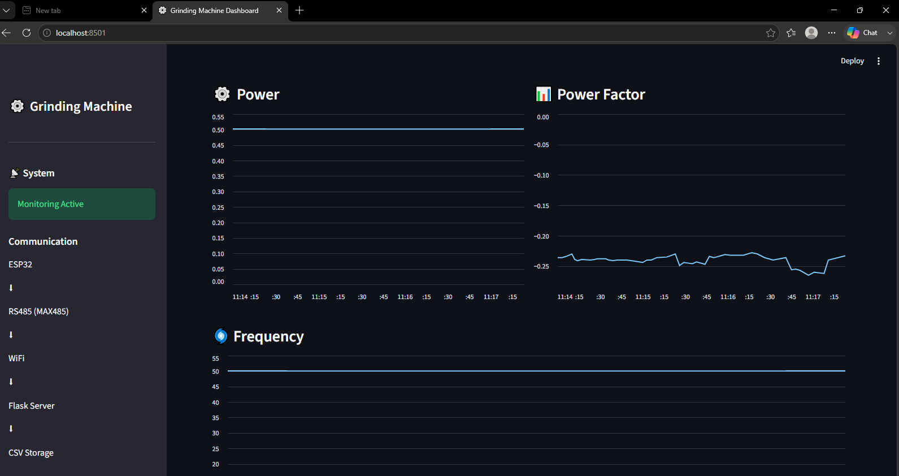
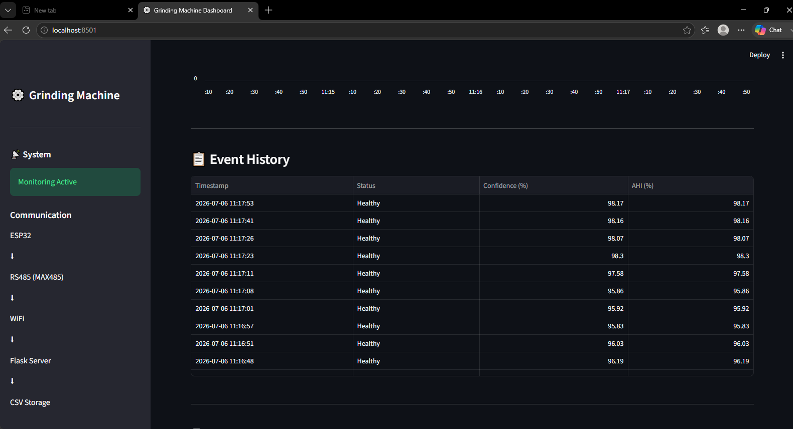
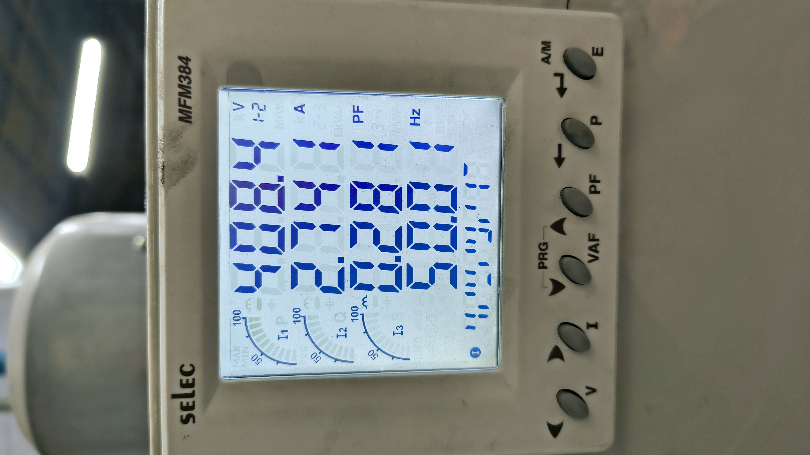
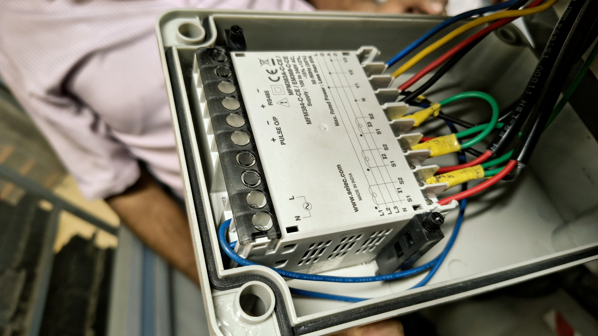
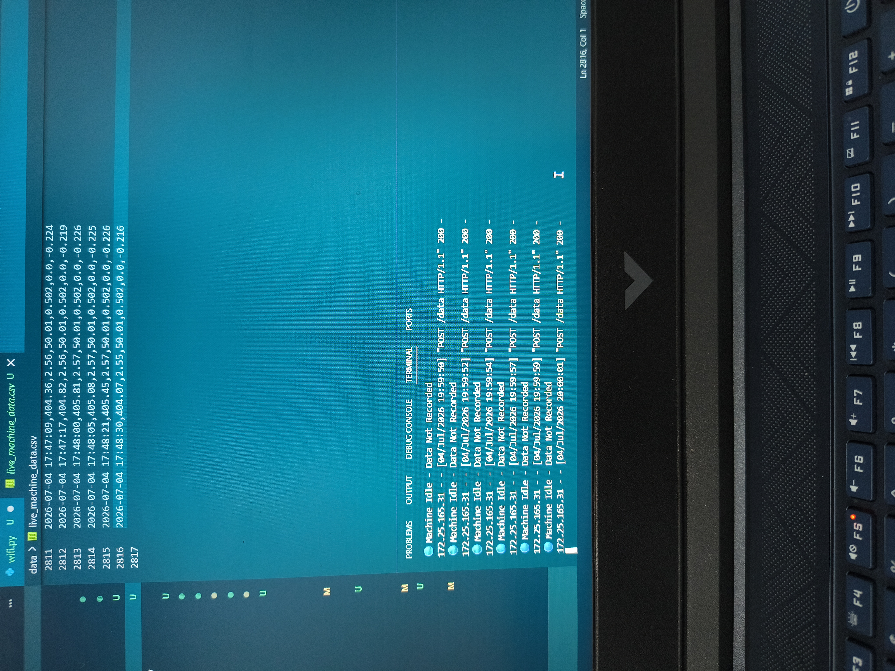

# 🏭 Grinding Machine Predictive Maintenance System (Version 3.0)

> **Industrial IoT-based Predictive Maintenance System for a Surface Grinding Machine using RS485 Modbus, ESP32, Flask, Streamlit and Machine Learning.**


---

## 📌 Project Overview

This project is an Industrial IoT and Machine Learning based Predictive Maintenance System developed for a surface grinding machine.

The system continuously acquires electrical parameters from a **SELEC MFM384 Three-Phase Multifunction Energy Meter** through **RS485 Modbus RTU**, transfers the data using an **ESP32**, processes it through a **Flask server**, stores it locally, and visualizes real-time machine health on a **Streamlit Dashboard**.

A Machine Learning model analyzes the incoming data and predicts the operational health of the grinding machine to support predictive maintenance and reduce unexpected downtime.

---

## 🎯 Objectives

- Collect real-time electrical parameters from an industrial grinding machine.
- Monitor machine health continuously.
- Detect abnormal operating conditions.
- Predict machine condition using Machine Learning.
- Provide a live industrial dashboard.
- Demonstrate Industrial IoT integration for predictive maintenance.

---

## ⚙️ Hardware Used

- SELEC MFM384 Three-Phase Multifunction Energy Meter
- MAX485 RS485 to TTL Converter
- ESP32 Development Board
- Surface Grinding Machine
- Wi-Fi Network
- Industrial Power Supply

---

## 💻 Software Stack

- Python
- Flask
- Streamlit
- Pandas
- NumPy
- Scikit-Learn
- Arduino IDE
- VS Code

---

## 📡 System Architecture

```

Grinding Machine
│
▼

SELEC MFM384 Energy Meter
│
▼

RS485 Modbus RTU
│
▼

MAX485 Converter
│
▼

ESP32
│ WiFi
▼

Flask Server
│
▼

CSV Storage
│
▼

Machine Learning
│
▼

Streamlit Dashboard

```

---

## ✨ Features

- Real-time Industrial IoT Data Acquisition
- RS485 Modbus Communication
- ESP32 Wi-Fi Integration
- Live Streamlit Dashboard
- Machine Learning Health Prediction
- Automatic Data Logging
- Real-time Visualization
- Asset Health Monitoring
- Industrial Sensor Integration

---

## 📸 Dashboard Preview

### Live Industrial Dashboard



### Health Prediction Panel


### Live Monitoring



### Machine Analytics



---

# 🏭 Hardware Setup

## SELEC MFM384 Energy Meter



---

## Rear Wiring of Energy Meter



---

## ESP32 + MAX485 Communication Module


---

## Live Data Collection Output



---

# 📂 Project Structure

```
Grinding-Machine-Predictive-Maintenance-v3
│
├── data/
│   ├── live_machine_data.csv
│
├── docs/
│   ├── dashboard.png
│   ├── dashboard_2.png
│   ├── dashboard_3.png
│   ├── dashboard_4.png
│   ├── Meter_Reading.jpg
│   ├── Meter_backside.jpg
│   ├── Esp32_and_Max485.jpg
│
├── esp32_usb/
├── esp32_wifi/
├── models/
├── src/
│
├── dashboard.py
├── config.py
├── README.md
├── requirements.txt
└── .gitignore
```

---

# 🚀 Installation

## Clone Repository

```bash
git clone https://github.com/manaswa14/Grinding-Machine-Predictive-Maintenance-v3.git
```

Move into the project

```bash
cd Grinding-Machine-Predictive-Maintenance-v3
```

Install dependencies

```bash
pip install -r requirements.txt
```

Start Flask Server

```bash
python src/wifi.py
```

Run Dashboard

```bash
streamlit run dashboard.py
```

---

# 📊 Parameters Monitored

- Voltage
- Current
- Frequency
- Power
- Power Factor
- Machine Health
- Isolation Forest Score

---

# 🧠 Machine Learning

The system uses an **Isolation Forest** anomaly detection model.

Workflow:

1. Read live electrical parameters
2. Scale the input features
3. Predict normal or abnormal behavior
4. Display machine health
5. Recommend maintenance when anomalies are detected

---

---

# 📈 Project Results

✅ Successfully established RS485 Modbus RTU communication between the SELEC MFM384 Energy Meter and ESP32.

✅ Implemented real-time Wi-Fi data transmission from ESP32 to a Flask server.

✅ Developed a live Streamlit dashboard for monitoring electrical parameters.

✅ Collected and stored real-time industrial machine data in CSV format.

✅ Implemented Machine Learning-based anomaly detection using Isolation Forest.

✅ Generated live machine health predictions from incoming sensor data.

✅ Designed a scalable architecture that can be extended to cloud storage and predictive analytics.

---

# 🔮 Future Improvements

- SQL / PostgreSQL Database Integration
- Cloud Deployment (AWS / Azure / GCP)
- MQTT-Based Communication
- Email & SMS Alert Notifications
- Predictive Failure Estimation
- Remaining Useful Life (RUL) Prediction
- Multiple Machine Monitoring
- Mobile Dashboard
- Historical Analytics
- Grafana Integration

---

# 📚 Technologies Used

| Category | Technology |
|-----------|------------|
| Programming | Python, C++ |
| Dashboard | Streamlit |
| Backend | Flask |
| Machine Learning | Scikit-Learn |
| Data Processing | Pandas, NumPy |
| Visualization | Plotly |
| Embedded System | ESP32 |
| Communication | RS485 Modbus RTU |
| IDE | VS Code, Arduino IDE |

---

# 📂 Dataset

The project uses real-time industrial electrical parameters collected from a surface grinding machine.

Parameters include:

- Voltage
- Current
- Frequency
- Power
- Power Factor

The data is collected continuously through the ESP32 and stored locally for machine learning and visualization.

---

# 📜 Version History

### Version 1.0
- Initial Predictive Maintenance Prototype
- Basic Dashboard
- Simulated Dataset

### Version 2.0
- Improved Dashboard
- Machine Learning Integration
- Live Data Simulation

### Version 3.0 (Current)
- Real Industrial Data Collection
- ESP32 Wi-Fi Communication
- RS485 Modbus Integration
- Flask Server
- Streamlit Live Dashboard
- Isolation Forest Prediction
- Industrial IoT Architecture

---

# 👨‍💻 Author

**Manaswa Medhi**

AI / ML Engineering Intern

Industrial IoT & Machine Learning Developer

GitHub:
https://github.com/manaswa14

---

# 🙏 Acknowledgements

This project was developed as part of an industrial internship focused on AI-driven predictive maintenance for manufacturing systems.

Special thanks to the mentors and engineering team for their guidance and support throughout the project.

---

# ⭐ If you found this project interesting...

Please consider giving it a ⭐ on GitHub!

It motivates future development and improvements.

---

## License

This project is intended for educational, research, and demonstration purposes.
